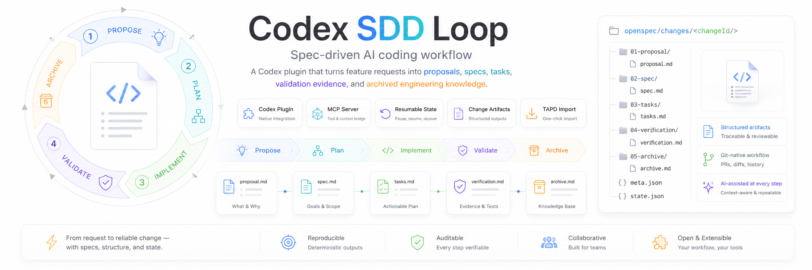
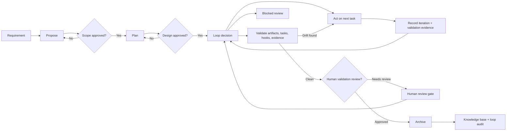

<h1 align="center">Codex SDD Loop</h1>

<p align="center">
  
</p>

<p align="center">
  Spec-driven loop engineering for Codex. Turn feature requests into goals, proposals, specs, tasks, validation evidence, human-reviewed gates, and archived engineering knowledge.
</p>

<p align="center">
  <a href="https://github.com/skyloevil/codex-sdd-loop/blob/main/LICENSE"></a>
  <a href="https://github.com/skyloevil/codex-sdd-loop"></a>
  <a href="./mcp-server/package.json"></a>
  <a href="https://modelcontextprotocol.io"></a>
</p>

---

## What is Codex SDD Loop?

Codex SDD Loop is a Codex plugin that brings spec-driven development and loop engineering into everyday AI-assisted engineering. Instead of jumping directly from a prompt to code, it keeps every change inside a traceable workflow with a goal-compatible runtime:

1. **Propose** - clarify scope, background, out-of-scope work, and acceptance criteria.
2. **Plan** - generate specs, design notes, task lists, verification plans, and implementation notes.
3. **Loop** - continue through act, validate, hook, human review, archive, complete, or blocked decisions.
4. **Implement** - work through tasks with durable progress tracking and iteration records.
5. **Validate** - check artifacts, tasks, hooks, structured evidence, and spec-vs-code drift.
6. **Archive** - preserve artifacts, loop state, validation evidence, and accumulated project knowledge.

The plugin is built around Codex skills plus a local MCP server. Skills guide the agent's behavior; the MCP server creates files, maintains workflow and loop state, validates changes, records evidence, enforces blocked/complete rules, and exposes status/continuation tools.

## Why use it?

- **Human gates where they matter** - review scope, design, validation, and archive readiness before the workflow advances.
- **Goal-compatible loop runtime** - track objective, success criteria, status, usage, blockers, validation evidence, human reviews, and next decisions.
- **Evidence-first validation** - completed tasks require structured validation evidence before archive.
- **Resumable work** - interrupted sessions can continue from `.openspec-codex/state.json` without re-explaining the change.
- **Change-scoped artifacts** - every feature or fix lives under `openspec/changes/<changeId>/`.
- **Custom team process** - project config, schemas, templates, rules, and hooks can be adapted to your engineering workflow.
- **Audit-friendly output** - proposals, specs, tasks, loop state, human reviews, verification evidence, and archives stay in your repository.

## Quick Start

### Prerequisites

- Codex desktop app with local plugin support
- Node.js 18 or newer
- npm 9 or newer

### Install from GitHub

```bash
git clone https://github.com/skyloevil/codex-sdd-loop.git
cd codex-sdd-loop
npm install --prefix mcp-server
npm run build --prefix mcp-server
```

Then install the plugin in Codex:

1. Open **Codex Settings**.
2. Go to **Plugins**.
3. Choose **Add from folder**.
4. Select the cloned `codex-sdd-loop` directory.

The plugin manifest is in `.codex-plugin/plugin.json`, and the MCP server configuration is in `.mcp.json`.

## Basic Usage

Start with a request in Codex:

```text
Use Codex SDD Loop to propose: Add user avatar upload
```

The workflow creates a change directory like this:

```text
openspec/changes/add-user-avatar-upload-20260627/
  proposal.md
  specs/spec.md
  design.md
  tasks.md
  verification.md
  implementation-notes.md
```

After the proposal is reviewed, continue the flow:

```text
Use Codex SDD Loop to plan this change
Use Codex SDD Loop to implement the next task
Use Codex SDD Loop to validate the current change
Use Codex SDD Loop to archive the completed change
```

You can also recover context at any point:

```text
Use Codex SDD Loop to show status
Use Codex SDD Loop to continue
```

For loop-driven work, use the continue entry point repeatedly. The runtime will decide whether the next step is implementation, validation, hook execution, human review, archive, completion, or blocked review.

## Optional TAPD Requirement Import

Codex SDD Loop includes an optional `tapd-requirement` MCP adapter that can fetch a TAPD story before proposal generation. This is useful when the source requirement lives in TAPD and the Codex prompt only contains a story URL.

Before using TAPD import, configure your TAPD API account and password in your local environment. Do not commit real credentials to this repository.

For local terminal testing, you can create a private `.tapd.env.local` file:

```bash
TAPD_API_USER=your_tapd_api_user
TAPD_API_PASSWORD=your_tapd_api_password
```

`.tapd.env.local` is ignored by git. For Codex plugin usage, provide the same variables through your shell environment, personal Codex MCP configuration, or another local secret mechanism available to your Codex runtime.

The bundled TAPD MCP adapter also attempts to load `.tapd.env.local` from the current project root and from the Codex SDD Loop plugin root. If another project cannot see `tapd-requirement:fetch_story`, reload Codex MCP servers after updating the plugin and confirm that the plugin MCP server is exposed in that session. If the tool is visible but fails with missing credentials, the MCP process cannot see `TAPD_API_USER` or `TAPD_API_PASSWORD`.

The plugin MCP configuration uses plugin-root-relative commands (`cwd: "."` with `./...` paths), so the OpenSpec and TAPD MCP tools are available from any project directory once the plugin is installed and MCP servers are reloaded.

After reloading Codex MCP servers, trigger proposal generation with a TAPD story URL:

```text
Use Codex SDD Loop to propose https://www.tapd.cn/tapd_fe/<workspace_id>/story/detail/<story_id>
```

The TAPD adapter parses the URL, calls the TAPD stories API, and returns normalized `proposalInput` fields for the OpenSpec proposal workflow. The raw TAPD API response is also included for custom field inspection.

## Commands and Skills

Codex SDD Loop ships with focused Codex skills:

| Skill | Purpose |
| --- | --- |
| `propose` | Create or refine the proposal and confirm scope. |
| `plan` | Produce specs, design, task, verification, and implementation artifacts. |
| `implement` | Execute tasks while updating progress and implementation notes. |
| `validate` | Check required artifacts, task completion, hooks, structured evidence, and drift. |
| `archive` | Move completed work into the archive and knowledge base. |
| `status` | Summarize active change state and next action. |
| `continue` | Resume from the state machine. |
| `customize` | Explain schema, template, rule, and hook customization. |
| `tapd-openspec-proposal` | Fetch a TAPD story before proposal generation. |

## MCP Tools

The MCP server exposes structured tools used by the skills and by Codex:

| Tool | Description |
| --- | --- |
| `openspec_init_project` | Create `openspec/config.yaml`, default schemas, change directories, and state. |
| `openspec_create_change` | Create a change directory and default artifacts. |
| `openspec_create_or_update_artifact` | Write proposal, specs, design, tasks, verification, or notes. |
| `openspec_get_status` | Return active change, gates, paths, phase, and next action. |
| `openspec_get_next_actions` | Derive the next workflow step from artifacts, gates, hooks, and tasks. |
| `openspec_create_goal` | Create a goal-compatible loop state for the active change. |
| `openspec_get_goal` | Return objective, loop status, usage, blockers, evidence, and next decision. |
| `openspec_continue_loop` | Advance the loop to the next action, validation, hook, human review, archive, complete, or blocked decision. |
| `openspec_record_iteration` | Record task execution feedback, files, commands, checks, errors, and evidence references. |
| `openspec_record_validation_evidence` | Store structured validation evidence in state, `verification.md`, and `verification.json`. |
| `openspec_request_human_review` | Create a pending human review gate for risk, validation, archive, or business approval. |
| `openspec_resolve_human_review` | Resolve a pending human review and map approved core reviews back to OpenSpec gates. |
| `openspec_update_goal_status` | Mark a loop complete, blocked, or cancelled while enforcing completion and blocker rules. |
| `openspec_update_task` | Mark task checkboxes complete or reopen them. |
| `openspec_validate` | Validate artifact presence, task status, required hooks, and loop validation evidence. |
| `openspec_archive_change` | Archive the active change and record knowledge-base metadata. |
| `openspec_get_pending_hooks` | List configured hooks for a workflow point. |
| `openspec_record_hook_result` | Record hook results in state and verification evidence. |

## Workflow



## State Model

Workflow state is stored in `.openspec-codex/state.json`. Version 3 supports multiple tracked changes with one active change and an optional loop state:

```json
{
  "version": 3,
  "activeChangeId": "add-user-avatar-upload-20260627",
  "changes": {
    "add-user-avatar-upload-20260627": {
      "phase": "implement",
      "preset": "full",
      "paths": {
        "changeDir": "openspec/changes/add-user-avatar-upload-20260627",
        "proposal": "openspec/changes/add-user-avatar-upload-20260627/proposal.md",
        "tasks": "openspec/changes/add-user-avatar-upload-20260627/tasks.md"
      },
      "gates": {
        "scope": true,
        "design": true,
        "validation": false,
        "archive": false
      },
      "loop": {
        "objective": "Add user avatar upload",
        "successCriteria": [
          "All required OpenSpec tasks are completed.",
          "Required validation evidence is recorded.",
          "Required hooks pass or are explicitly reviewed."
        ],
        "status": "running",
        "mode": "review",
        "usage": {
          "iterations": 3,
          "startedAt": "2026-06-27T00:00:00.000Z",
          "updatedAt": "2026-06-27T00:15:00.000Z"
        },
        "lastDecision": {
          "kind": "validate",
          "reason": "Validation has not been confirmed.",
          "nextAction": "Run validation and request validation review when clean.",
          "riskLevel": "medium",
          "requiredGate": "validation_review"
        },
        "blockers": [],
        "validationEvidence": [],
        "humanReviews": [],
        "iterations": []
      },
      "nextAction": "Implement the next incomplete task."
    }
  },
  "updatedAt": "2026-06-27T00:00:00.000Z"
}
```

This file is intentionally project-local so Codex can resume an interrupted workflow. Version 2 state files are migrated to version 3 on read while preserving existing change data.

## Customization

Initialize a project to create the default OpenSpec workspace:

```text
Use Codex SDD Loop to initialize this project
```

Generated configuration lives in:

```text
openspec/
  config.yaml
  schemas/
    spec-driven/
      schema.yaml
      templates/
```

You can customize:

- **Schemas** - choose which artifacts are required for full features, hotfixes, and small tweaks.
- **Templates** - define team-specific proposal, spec, design, task, verification, and notes formats.
- **Rules** - require architecture, compatibility, API, persistence, caching, or testing constraints.
- **Hooks** - call MCP tools, commands, or skills before and after workflow steps.
- **Human reviews** - require explicit approval for scope, design, validation, archive, destructive changes, external writes, security-sensitive changes, or blocked work.

Example hook configuration:

```yaml
hooks:
  pre_archive:
    - kind: skill
      name: implementation-notes-backfill
      required: true
```

Hook results are recorded with `openspec_record_hook_result`. Required `pre_archive` hooks block archive until they pass or are explicitly skipped. For loop-driven changes, validation evidence is recorded with `openspec_record_validation_evidence` and archived alongside metadata.

## Loop Semantics

Codex SDD Loop exposes a small goal-compatible runtime:

- `openspec_create_goal` creates or replaces the loop objective and success criteria.
- `openspec_continue_loop` returns the next structured decision: `act`, `validate`, `run_hook`, `ask_human`, `archive`, `complete`, or `blocked`.
- `openspec_update_goal_status` enforces terminal state rules. A goal cannot be marked `complete` before the change is archived, and the same blocker must recur three times before the loop can be marked `blocked`.
- `openspec_request_human_review` and `openspec_resolve_human_review` keep manual approval inside the same auditable state model.

The MCP server does not directly execute arbitrary shell commands for hooks. It provides scheduling, state, evidence, and review records; the Codex agent or a business-specific MCP tool performs the actual action and writes the result back.

## Development

Install dependencies:

```bash
npm install --prefix mcp-server
```

Build the MCP server:

```bash
npm run build --prefix mcp-server
```

Run tests:

```bash
npm test --prefix mcp-server
```

Run the server locally:

```bash
npm run dev --prefix mcp-server
```

## Project Structure

```text
codex-sdd-loop/
  .codex-plugin/
    plugin.json
  .mcp.json
  assets/
    icon.png
    logo.png
    logo-dark.png
  mcp-server/
    src/
      index.ts
      openspec.ts
      state.ts
      types.ts
    test/
      openspec.test.ts
    package.json
    tsconfig.json
  skills/
    archive/
    continue/
    customize/
    implement/
    plan/
    propose/
    status/
    tapd-openspec-proposal/
    validate/
  scripts/
    tapd-mcp-server.mjs
```

## Relationship to OpenSpec

This project follows the OpenSpec-style workflow and is designed for Codex plugin usage. It is inspired by the structured development loop promoted by [Fission-AI/OpenSpec](https://github.com/Fission-AI/OpenSpec), while focusing on local MCP tools, resumable state, and Codex skills.

## Contributing

Contributions are welcome. Please keep changes spec-driven:

1. Open an issue or proposal describing the behavior change.
2. Add or update tests for MCP server behavior when applicable.
3. Run `npm test --prefix mcp-server`.
4. Keep generated dependencies such as `node_modules/` out of commits.

## License

Codex SDD Loop is released under the [MIT License](./LICENSE).
